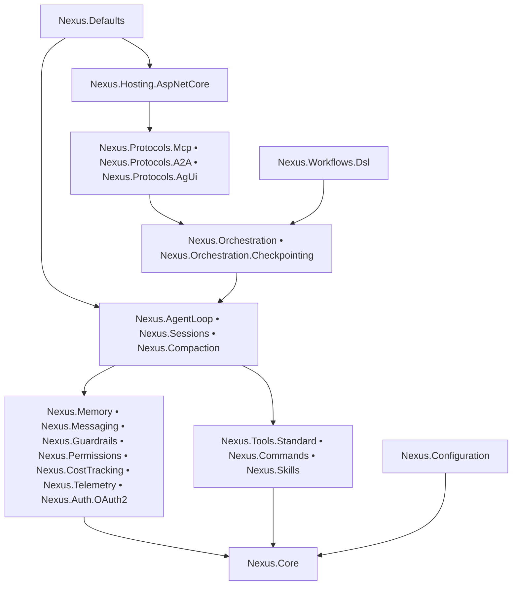

# Nexus

## Production-Grade Multi-Agent Runtime For .NET

Build agents, workflows, tools, memory, approvals, protocol bridges, and runtime guardrails in one coherent platform.

Nexus is for teams that want multi-agent systems to behave like engineered software: testable, observable, composable, benchmarked, and ready to operate under real constraints.

### Why Teams Pick Nexus

- 🚀 Orchestrate single agents, DAG workflows, parallel branches, fan-out/fan-in graphs, and batched sub-agents
- 🛡️ Enforce approvals, budgets, guardrails, retries, and checkpointing in the runtime instead of hiding control flow inside prompts
- 🧠 Combine tools, memory, messaging, and workflow DSLs without inventing custom orchestration glue
- 🔌 Expose the system through MCP, A2A, AG-UI, and ASP.NET Core hosting endpoints
- 📊 Track token usage, estimated cost, benchmark hot paths, and validate behavior with deterministic tests
- 🧪 Ship with test doubles, mocks, workflow tests, orchestration tests, CLI tests, and live integration coverage
- 🧱 Keep architecture modular across core runtime, protocols, hosting, testing, and standard tools
- ⚙️ Support human-in-the-loop execution, delegated specialist agents, and explicit workflow branching in the same stack
- 📚 Offer recipes, guides, benchmarks, and architecture docs for both humans and LLM-assisted development

## Architecture

## Start Here

- [Quick Start Guide](docs/guides/quick-start.md)
- [Documentation Index](docs/README.md)
- [Package Index](docs/api/README.md)
- [LLM Docs](docs/llms/README.md)
- [Installation](docs/getting-started/installation.md)
- [CLI Getting Started](docs/getting-started/cli.md)
- [Quick Start Entry](docs/getting-started/quickstart.md)
- [Recipe Index](docs/recipes/README.md)
- [Examples Index](examples/README.md)
- [Benchmarks README](benchmarks/README.md)

## Recipes

- [Existing Provider UI](docs/recipes/existing-provider-ui.md)
- [Single Agent With Tools](docs/recipes/single-agent-with-tools.md)
- [Chat Session With Memory](docs/recipes/chat-session-with-memory.md)
- [Human-Approved Workflow](docs/recipes/human-approved-workflow.md)
- [Parallel Sub-Agents And Workflow Fan-Out](docs/recipes/parallel-subagents-and-workflow-fanout.md)
- [Checkpointed Recovery Workflow](docs/recipes/checkpointed-recovery-workflow.md)
- [Tool-Only Worker Agent](docs/recipes/tool-only-worker-agent.md)
- [Cost-Aware Batch Processing](docs/recipes/cost-aware-batch-processing.md)
- [Task System + Graph Brain](docs/recipes/task-system-graph-brain.md)

## Runnable Scenario Examples

- [Single Agent With Tools Example](examples/Nexus.Examples.SingleAgentWithTools/README.md)
- [Chat Session With Memory Example](examples/Nexus.Examples.ChatSessionWithMemory/README.md)
- [Human-Approved Workflow Example](examples/Nexus.Examples.HumanApprovedWorkflow/README.md)
- [Parallel Sub-Agents And Workflow Fan-Out Example](examples/Nexus.Examples.ParallelSubAgentsAndWorkflowFanOut/README.md)
- [Chat Editing With Diff And Revert Example](examples/Nexus.Examples.ChatEditingWithDiffAndRevert/README.md)

## Guides

- [Quick Start](docs/guides/quick-start.md)
- [Orchestration](docs/guides/orchestration.md)
- [Sub-Agents](docs/guides/sub-agents.md)
- [Performance And Benchmarking](docs/guides/performance-and-benchmarking.md)
- [Production Hardening](docs/guides/production-hardening.md)
- [CI And Quality Gates](docs/guides/ci-and-quality-gates.md)
- [Workflow Patterns And Anti-Patterns](docs/guides/workflow-patterns-and-anti-patterns.md)
- [External Brain & Task System](docs/guides/external-brain-task-system.md)
- [Memory](docs/guides/memory.md)
- [Guardrails](docs/guides/guardrails.md)
- [Permissions](docs/guides/permissions.md)
- [Cost Tracking](docs/guides/cost-tracking.md)
- [Messaging](docs/guides/messaging.md)
- [Checkpointing](docs/guides/checkpointing.md)
- [Workflows DSL](docs/guides/workflows-dsl.md)
- [Protocols](docs/guides/protocols.md)
- [Telemetry](docs/guides/telemetry.md)
- [Auth](docs/guides/auth.md)
- [Testing](docs/guides/testing.md)
- [Middleware](docs/guides/middleware.md)

## Architecture Docs

- [Architecture Overview](docs/architecture/overview.md)
- [Core Engine](docs/architecture/core-engine.md)

## API Docs

- [Package Index](docs/api/README.md)
- [Nexus.Core](docs/api/nexus-core.md)
- [Nexus.AgentLoop](docs/api/nexus-agent-loop.md)
- [Nexus.Auth.OAuth2](docs/api/nexus-auth-oauth2.md)
- [Nexus.Commands](docs/api/nexus-commands.md)
- [Nexus.Compaction](docs/api/nexus-compaction.md)
- [Nexus.Configuration](docs/api/nexus-configuration.md)
- [Nexus.Defaults](docs/api/nexus-defaults.md)
- [Nexus.Orchestration](docs/api/nexus-orchestration.md)
- [Nexus.Orchestration.Checkpointing](docs/api/nexus-orchestration-checkpointing.md)
- [Nexus.Memory](docs/api/nexus-memory.md)
- [Nexus.Guardrails](docs/api/nexus-guardrails.md)
- [Nexus.Permissions](docs/api/nexus-permissions.md)
- [Nexus.CostTracking](docs/api/nexus-cost-tracking.md)
- [Nexus.Messaging](docs/api/nexus-messaging.md)
- [Nexus.Sessions](docs/api/nexus-sessions.md)
- [Nexus.Skills](docs/api/nexus-skills.md)
- [Nexus.Telemetry](docs/api/nexus-telemetry.md)
- [Nexus.Tools.Standard](docs/api/nexus-tools-standard.md)
- [Nexus.Workflows.Dsl](docs/api/nexus-workflows-dsl.md)
- [Nexus.Protocols](docs/api/nexus-protocols.md)
- [Nexus.Protocols.Mcp](docs/api/nexus-protocols-mcp.md)
- [Nexus.Protocols.A2A](docs/api/nexus-protocols-a2a.md)
- [Nexus.Protocols.AgUi](docs/api/nexus-protocols-agui.md)
- [Nexus.Hosting.AspNetCore](docs/api/nexus-hosting-aspnetcore.md)
- [Nexus.Testing](docs/api/nexus-testing.md)

## LLM Docs

- [LLM Docs Index](docs/llms/README.md)
- [Runtime Map](docs/llms/runtime-map.md)
- [Agent Loop](docs/llms/agent-loop.md)
- [Workflows DSL](docs/llms/workflows-dsl.md)
- [Tools And Sub-Agents](docs/llms/tools-and-subagents.md)
- [Testing And Benchmarks](docs/llms/testing-and-benchmarks.md)
- [Glossary](docs/llms/glossary.md)

## Examples Docs

- [Minimal Agent](docs/examples/minimal.md)
- [Multi-Agent Graph](docs/examples/multi-agent.md)
- [Chat Editing With Diff And Revert](docs/examples/chat-editing-with-diff-and-revert.md)
- [Nexus CLI](docs/examples/nexus-cli.md)
- [Examples Index](examples/README.md)

## Project Structure

- src: Core runtime, orchestration, checkpointing, memory, messaging, guardrails, permissions, cost tracking, telemetry, auth, protocols, standard tools, workflow DSL, hosting, and testing utilities
- examples: CLI, minimal setup, multi-agent examples, and runnable recipe apps
- tests: Unit, integration, live, CLI, orchestration, workflow, and runtime tests
- benchmarks: Workflow and sub-agent benchmark suite
- docs: Guides, recipes, LLM docs, API references, architecture, and getting started material

## Test Coverage And Test Count

- 389 tests passed in the latest full solution run across 25 test projects
- Coverage metrics are collected via CI and updated with each release

## Benchmark Results

- [benchmarks/Nexus.Benchmarks](benchmarks/Nexus.Benchmarks) contains the workflow and sub-agent runtime benchmark suite
- Latest measured results on the current workstation:
- CompileWorkflow: 1.788 μs mean, 5.15 KB allocated
- ExecuteWorkflow: 92.894 μs mean, 39.17 KB allocated
- RunParallelSubAgents: 3.670 μs mean, 8.2 KB allocated
- Full benchmark reports are written to BenchmarkDotNet.Artifacts/results

## Credits

- Built on .NET 10 and `Microsoft.Extensions.DependencyInjection`
- AI abstraction layer powered through `Microsoft.Extensions.AI`
- Workflow serialization support via `YamlDotNet`
- Benchmarking via `BenchmarkDotNet`
- Testing with `xUnit` and `FluentAssertions`
- CLI presentation powered by `Spectre.Console`

## License

[MIT](LICENSE)