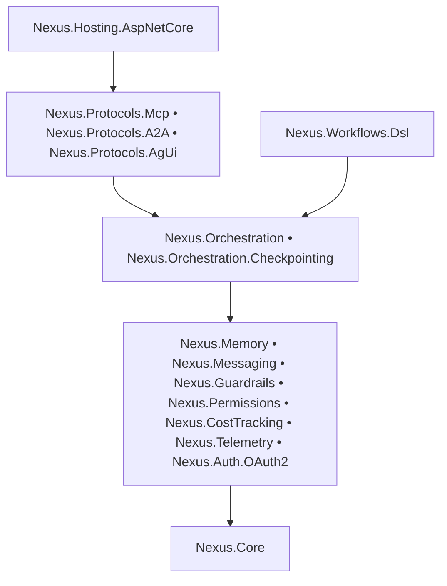

# Nexus

## Production-Grade Multi-Agent Runtime For .NET

Build agents, workflows, tools, memory, approvals, protocol bridges, and runtime guardrails in one coherent platform.

Nexus is for teams that want multi-agent systems to behave like engineered software: testable, observable, composable, benchmarked, and ready to operate under real constraints.

### Why Teams Pick Nexus

- 🚀 Orchestrate single agents, DAG workflows, parallel branches, fan-out/fan-in graphs, and batched sub-agents
- 🛡️ Enforce approvals, budgets, guardrails, retries, and checkpointing in the runtime instead of hiding control flow inside prompts
- 🧠 Combine tools, memory, messaging, and workflow DSLs without inventing custom orchestration glue
- 🔌 Expose the system through MCP, A2A, AG-UI, and ASP.NET Core hosting endpoints
- 📊 Track token usage, estimated cost, benchmark hot paths, and validate behavior with deterministic tests
- 🧪 Ship with test doubles, mocks, workflow tests, orchestration tests, CLI tests, and live integration coverage
- 🧱 Keep architecture modular across core runtime, protocols, hosting, testing, and standard tools
- ⚙️ Support human-in-the-loop execution, delegated specialist agents, and explicit workflow branching in the same stack
- 📚 Offer recipes, guides, benchmarks, and architecture docs for both humans and LLM-assisted development

## Architecture

## Start Here

- [Quick Start Guide](docs/guides/quick-start.md)
- [Documentation Index](docs/README.md)
- [Installation](docs/getting-started/installation.md)
- [CLI Getting Started](docs/getting-started/cli.md)
- [Quick Start Entry](docs/getting-started/quickstart.md)
- [Recipe Index](docs/recipes/README.md)
- [Benchmarks README](benchmarks/README.md)

## Recipes

- [Single Agent With Tools](docs/recipes/single-agent-with-tools.md)
- [Chat Session With Memory](docs/recipes/chat-session-with-memory.md)
- [Human-Approved Workflow](docs/recipes/human-approved-workflow.md)
- [Parallel Sub-Agents And Workflow Fan-Out](docs/recipes/parallel-subagents-and-workflow-fanout.md)
- [Task System + Graph Brain](docs/recipes/task-system-graph-brain.md)

## Guides

- [Quick Start](docs/guides/quick-start.md)
- [Orchestration](docs/guides/orchestration.md)
- [Sub-Agents](docs/guides/sub-agents.md)
- [External Brain & Task System](docs/guides/external-brain-task-system.md)
- [Memory](docs/guides/memory.md)
- [Guardrails](docs/guides/guardrails.md)
- [Permissions](docs/guides/permissions.md)
- [Cost Tracking](docs/guides/cost-tracking.md)
- [Messaging](docs/guides/messaging.md)
- [Checkpointing](docs/guides/checkpointing.md)
- [Workflows DSL](docs/guides/workflows-dsl.md)
- [Protocols](docs/guides/protocols.md)
- [Telemetry](docs/guides/telemetry.md)
- [Auth](docs/guides/auth.md)
- [Testing](docs/guides/testing.md)
- [Middleware](docs/guides/middleware.md)

## Architecture Docs

- [Architecture Overview](docs/architecture/overview.md)
- [Core Engine](docs/architecture/core-engine.md)

## API Docs

- [Nexus.Core](docs/api/nexus-core.md)
- [Nexus.Orchestration](docs/api/nexus-orchestration.md)
- [Nexus.Memory](docs/api/nexus-memory.md)
- [Nexus.Guardrails](docs/api/nexus-guardrails.md)
- [Nexus.Permissions](docs/api/nexus-permissions.md)
- [Nexus.CostTracking](docs/api/nexus-cost-tracking.md)
- [Nexus.Messaging](docs/api/nexus-messaging.md)
- [Nexus.Workflows.Dsl](docs/api/nexus-workflows-dsl.md)
- [Nexus.Protocols](docs/api/nexus-protocols.md)
- [Nexus.Testing](docs/api/nexus-testing.md)

## Examples Docs

- [Minimal Agent](docs/examples/minimal.md)
- [Multi-Agent Graph](docs/examples/multi-agent.md)
- [Nexus CLI](docs/examples/nexus-cli.md)

## Project Structure

- src: Core runtime, orchestration, checkpointing, memory, messaging, guardrails, permissions, cost tracking, telemetry, auth, protocols, standard tools, workflow DSL, hosting, and testing utilities
- examples: CLI, minimal setup, and multi-agent examples
- tests: Unit, integration, live, CLI, orchestration, workflow, and runtime tests
- benchmarks: Workflow and sub-agent benchmark suite
- docs: Guides, recipes, API references, architecture, and getting started material

## Test Coverage And Test Count

- 300 tests passed in the latest full solution run
- Full-solution line coverage: 77.36% (11,118 of 14,372 lines)
- Full-solution branch coverage: 59.15% (2,464 of 4,166 branches)
- Focused runtime coverage is strongest on the core paths changed most recently:
- [src/Nexus.Tools.Standard/AgentTool.cs](src/Nexus.Tools.Standard/AgentTool.cs): 81.5%
- [src/Nexus.Workflows.Dsl/WorkflowExecution.cs](src/Nexus.Workflows.Dsl/WorkflowExecution.cs): 82.7%
- [src/Nexus.Orchestration/Defaults/DefaultOrchestrator.cs](src/Nexus.Orchestration/Defaults/DefaultOrchestrator.cs): 76.5%
- [src/Nexus.Orchestration/Defaults/DefaultTaskGraph.cs](src/Nexus.Orchestration/Defaults/DefaultTaskGraph.cs): 90.4%

## Benchmark Results

- [benchmarks/Nexus.Benchmarks](benchmarks/Nexus.Benchmarks) contains the workflow and sub-agent runtime benchmark suite
- Latest measured results on the current workstation:
- CompileWorkflow: 1.961 μs mean, 5.15 KB allocated
- ExecuteWorkflow: 82.142 μs mean, 39.24 KB allocated
- RunParallelSubAgents: 3.689 μs mean, 8.2 KB allocated
- Full benchmark reports are written to BenchmarkDotNet.Artifacts/results

## Credits

- Built on .NET 10 and `Microsoft.Extensions.DependencyInjection`
- AI abstraction layer powered through `Microsoft.Extensions.AI`
- Workflow serialization support via `YamlDotNet`
- Benchmarking via `BenchmarkDotNet`
- Testing with `xUnit` and `FluentAssertions`
- CLI presentation powered by `Spectre.Console`

## License

[MIT](LICENSE)