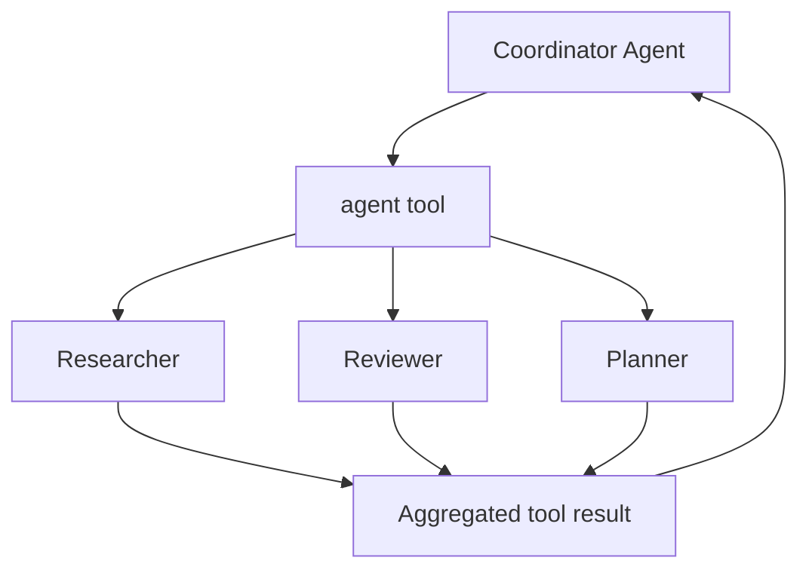

# Sub-Agents

Use sub-agents when one coordinator should delegate bounded work to specialized workers without leaving the current session.

Nexus now supports both:

- single delegation through the `agent` tool
- batched delegation with parallel execution and a concurrency limit

## Mental Model



The coordinator stays in control. Each spawned worker receives an isolated task, runs with its own agent definition, and is terminated after completion.

## When To Use Them

Use sub-agents when:

- one task can be split into independent specialist jobs
- the coordinator should compare multiple viewpoints before deciding
- you want local fan-out without creating a full orchestration graph

Prefer the workflow DSL when:

- dependencies between stages matter
- branch conditions should be explicit and reproducible
- you want graph-level concurrency, checkpointing, or deterministic routing

## Single Delegation

```json
{
  "agent": "Reviewer",
  "task": "Review the patch for API regressions",
  "systemPrompt": "Focus on correctness, compatibility, and missing tests.",
  "toolNames": ["grep", "file_read"]
}
```

This returns a single `AgentToolResult`.

## Parallel Delegation

```json
{
  "maxConcurrency": 2,
  "tasks": [
    {
      "agent": "Researcher",
      "task": "Collect supporting facts for the design note"
    },
    {
      "agent": "Reviewer",
      "task": "Review the design note for failure modes"
    },
    {
      "agent": "Planner",
      "task": "Suggest the next implementation slice"
    }
  ]
}
```

This returns an `AgentBatchToolResult` with:

- one result entry per delegated worker
- aggregate status: `Success`, `PartialSuccess`, or `Failed`
- optional total estimated cost
- a text summary the parent agent can feed back into its own reasoning

## Step By Step

1. Register standard tools with agent support.
2. Let the coordinator decide whether to delegate a single job or a batch.
3. Set `maxConcurrency` to cap parallel fan-out.
4. Aggregate the worker outputs in the coordinator prompt or into a downstream workflow node.

```csharp
services.AddNexus(nexus =>
{
    nexus.UseChatClient(_ => chatClient);
    nexus.AddOrchestration(o => o.UseDefaults());
    nexus.AddStandardTools(tools => tools.Agents());
});
```

## Concurrency Semantics

- Each batch entry spawns a separate child agent.
- `maxConcurrency` limits how many child agents run at once.
- Failures are isolated per child in batch mode.
- A single-request invocation still fails the tool call directly when the child fails.

## Recommended Patterns

- Use 2-4 workers for comparison-style tasks.
- Keep child tasks narrow and independent.
- Give each child only the tools it needs.
- Follow batched sub-agents with a reviewer or synthesis step.

## Related Guides

- [Orchestration](orchestration.md)
- [Workflows DSL](workflows-dsl.md)
- [Testing](testing.md)