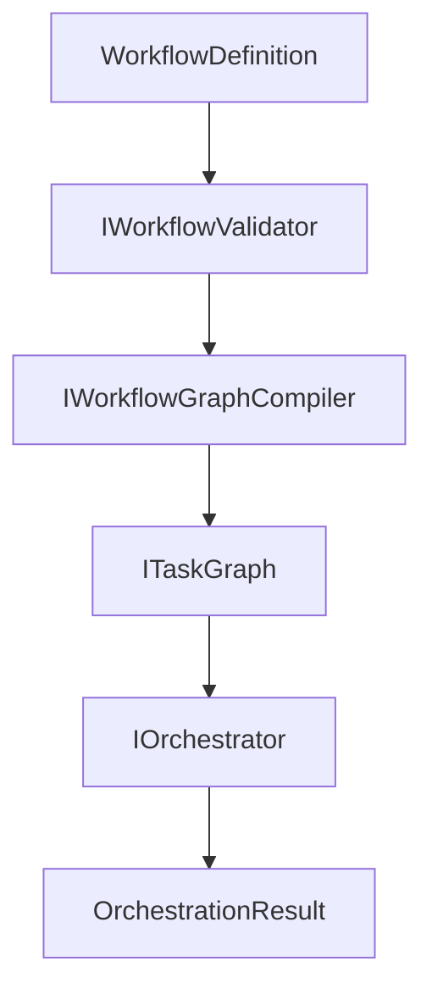

# Workflows DSL

Define agent orchestration pipelines declaratively in JSON or YAML.

## Use This Guide When

Use the DSL when workflow structure should be reviewed, stored, loaded, validated, or changed without recompiling application code.

If your workflow is tiny and fully code-owned, plain orchestration may stay simpler.

If you use `budget.maxCostUsd`, register `AddCostTracking(...)` as well. Runtime cost enforcement depends on provider usage metadata flowing through the cost-tracking wrapper.

Nexus now provides a first-class bridge from the DSL into the orchestration runtime through `IWorkflowGraphCompiler` and `IWorkflowExecutor`.

## Execution Model



The key runtime rules are:

- `maxConcurrentNodes` limits how many ready nodes run at once.
- multiple ready nodes can execute in parallel through the graph orchestrator.
- conditional edges are evaluated after the source node completes.
- if all incoming conditions for a node resolve to false, Nexus skips that node explicitly.

## Quick Decision

- choose orchestration code when the graph is small and fully local to one code path
- choose the DSL when workflow review, serialization, or external authoring matters
- choose checkpointing when rerunning the whole graph is too expensive

## WorkflowDefinition

The root model for a workflow:

```csharp
public record WorkflowDefinition
{
    public required string Id { get; init; }
    public required string Name { get; init; }
    public string? Description { get; init; }
    public string Version { get; init; } = "1.0.0";
    public required IReadOnlyList<NodeDefinition> Nodes { get; init; }
    public IReadOnlyList<EdgeDefinition> Edges { get; init; } = [];
    public IReadOnlyDictionary<string, object> Variables { get; init; } = new Dictionary<string, object>();
    public WorkflowOptions? Options { get; init; }
}
```

## JSON Example

```json
{
    "id": "content-pipeline",
    "name": "Content Pipeline",
    "version": "1.0.0",
    "variables": {
        "topic": "AI trends in 2025",
        "maxBudget": 5.0
    },
    "nodes": [
        {
            "id": "research",
            "name": "Researcher",
            "description": "Research ${topic}",
            "agent": {
                "type": "chat",
                "systemPrompt": "You are a research specialist.",
                "tools": ["web_search", "read_url"],
                "budget": {
                    "maxCostUsd": 2.0,
                    "maxIterations": 10
                }
            }
        },
        {
            "id": "write",
            "name": "Writer",
            "description": "Write blog post about findings",
            "agent": {
                "systemPrompt": "You are a professional writer.",
                "modelId": "gpt-4o",
                "budget": {
                    "maxCostUsd": 1.5
                }
            }
        },
        {
            "id": "review",
            "name": "Reviewer",
            "description": "Review and approve content",
            "agent": {
                "systemPrompt": "You are an editor. Approve or request revisions.",
                "modelId": "gpt-4o-mini"
            },
            "errorPolicy": {
                "maxRetries": 2,
                "escalateToHuman": true
            }
        }
    ],
    "edges": [
        { "from": "research", "to": "write" },
        {
            "from": "write",
            "to": "review",
            "contextPropagation": {
                "strategy": "full"
            }
        }
    ],
    "options": {
        "maxConcurrentNodes": 4,
        "globalTimeoutSeconds": 600,
        "checkpointStrategy": "after-each-node"
    }
}
```

## YAML Example

```yaml
id: content-pipeline
name: Content Pipeline
version: "1.0.0"
variables:
  topic: AI trends in 2025
nodes:
  - id: research
    name: Researcher
    description: "Research ${topic}"
    agent:
      tools: [web_search, read_url]
      budget:
        maxCostUsd: 2.0
  - id: write
    name: Writer
    description: Write blog post about findings
    agent:
      modelId: gpt-4o
  - id: review
    name: Reviewer
    description: Review and approve content
edges:
  - from: research
    to: write
  - from: write
    to: review
```

## Loading Workflows

```csharp
var loader = sp.GetRequiredService<IWorkflowLoader>();

// From file (auto-detects format by extension)
var workflow = await loader.LoadFromFileAsync("pipeline.json");
var yamlWorkflow = await loader.LoadFromFileAsync("pipeline.yaml");

// From string
var workflow = loader.LoadFromString(jsonString, "json");
var workflow = loader.LoadFromString(yamlString, "yaml");

// From stream
var workflow = await loader.LoadFromStreamAsync(stream, "json");
```

## Compile And Execute

```csharp
var compiler = sp.GetRequiredService<IWorkflowGraphCompiler>();
var executor = sp.GetRequiredService<IWorkflowExecutor>();

var compiled = compiler.Compile(workflow, new Dictionary<string, object>
{
    ["topic"] = "parallel workflow routing"
});

var result = await executor.ExecuteAsync(workflow);
```

Use the compiler when you want access to the generated `ITaskGraph` or resolved `OrchestrationOptions`. Use the executor when you want the full validate-compile-run pipeline.

## Validation

Validate before execution:

```csharp
var validator = sp.GetRequiredService<IWorkflowValidator>();
var result = validator.Validate(workflow);

if (!result.IsValid)
{
    foreach (var error in result.Errors)
        Console.WriteLine($"  Error: {error}");
    return;
}
```

The validator checks for:
- Required fields (ID, name, at least one node)
- Duplicate node IDs
- Edges referencing non-existent nodes
- Self-referencing edges
- Graph cycles (DFS)
- Negative budgets

## Serialization

Export workflows back to JSON or YAML:

```csharp
var serializer = sp.GetRequiredService<IWorkflowSerializer>();

var json = serializer.Serialize(workflow, "json");
var yaml = serializer.Serialize(workflow, "yaml");

await serializer.SerializeToFileAsync(workflow, "output.json", "json");
```

## Read Next

- runtime graph execution: [Orchestration](orchestration.md)
- durable recovery: [Checkpointing](checkpointing.md)
- staged example: [Human-Approved Workflow](../recipes/human-approved-workflow.md)

## Variables

Use `${variable}` syntax for template substitution:

```json
{
    "variables": { "model": "gpt-4o", "budget": 2.0 },
    "nodes": [{
        "description": "Using model ${model} with budget ${budget}"
    }]
}
```

The `IVariableResolver` resolves these at load time.

## Conditional Edges

Route execution based on agent results:

```json
{
    "edges": [
        {
            "from": "review",
            "to": "revision",
            "condition": "result.status == 'Failed'"
        },
        {
            "from": "review",
            "to": "publish",
            "condition": "result.status == 'Success'"
        }
    ]
}
```

The `IConditionEvaluator` supports:
- `result.status == 'Success'` / `'Failed'`
- `result.status == 'BudgetExceeded'`
- `result.text.contains('keyword')`

This makes it possible to branch explicitly when a node exhausts its cost budget:

```json
{
    "edges": [
        {
            "from": "research",
            "to": "fallback-research",
            "condition": "result.status == 'BudgetExceeded'"
        },
        {
            "from": "research",
            "to": "write",
            "condition": "result.status == 'Success'"
        }
    ]
}
```

For this to work in runtime execution, combine workflow budgets with `AddCostTracking(...)` so the default budget tracker receives token and cost updates from the chat client.

## Parallel Fan-Out Example

```json
{
    "id": "triage",
    "name": "Triage",
    "nodes": [
        { "id": "classify", "name": "Classifier", "description": "Classify the incident" },
        { "id": "investigate", "name": "Investigator", "description": "Investigate root cause" },
        { "id": "draft", "name": "Drafter", "description": "Draft customer update" },
        { "id": "publish", "name": "Publisher", "description": "Publish approved update" }
    ],
    "edges": [
        { "from": "classify", "to": "investigate" },
        { "from": "classify", "to": "draft" },
        {
            "from": "draft",
            "to": "publish",
            "condition": "result.text.contains('approved')"
        }
    ],
    "options": {
        "maxConcurrentNodes": 2
    }
}
```

After `classify` completes, `investigate` and `draft` can run in parallel because both become ready at the same time.

## Budget-Aware Execution

Workflow budgets are declarative in the DSL, but runtime enforcement still depends on provider usage metadata.

```csharp
services.AddNexus(nexus =>
{
    nexus.UseChatClient(_ => myChatClient);
    nexus.AddCostTracking(c => c.AddModel("gpt-4o", input: 2.50m, output: 10.00m));
    nexus.AddOrchestration(o => o.UseDefaults());
});
```

When a node exceeds `maxCostUsd`, the completed node result surfaces `AgentResultStatus.BudgetExceeded` and preserves the last known `TokenUsage` and `EstimatedCost`.

## Node Configuration

### AgentConfig

```csharp
public record AgentConfig
{
    public string Type { get; init; } = "chat";
    public string? SystemPrompt { get; init; }
    public string? ChatClient { get; init; }
    public string? ModelId { get; init; }
    public IReadOnlyList<string> Tools { get; init; } = [];
    public IReadOnlyList<string> McpServers { get; init; } = [];
    public BudgetConfig? Budget { get; init; }
    public ContextWindowConfig? ContextWindow { get; init; }
}
```

### ErrorPolicyConfig

```csharp
public record ErrorPolicyConfig
{
    public int? MaxRetries { get; init; }
    public string? BackoffType { get; init; }
    public string? FallbackChatClient { get; init; }
    public string? FallbackModelId { get; init; }
    public bool EscalateToHuman { get; init; }
    public bool SendToDeadLetter { get; init; }
    public int MaxIterations { get; init; } = 25;
    public int TimeoutSeconds { get; init; } = 300;
}
```

### WorkflowOptions

```csharp
public record WorkflowOptions
{
    public int? MaxConcurrentNodes { get; init; }
    public int? GlobalTimeoutSeconds { get; init; }
    public decimal? MaxTotalCostUsd { get; init; }
    public string? CheckpointStrategy { get; init; }
}
```

## Custom Agent Types

Register custom agent type factories for use in DSL workflows:

```csharp
var registry = sp.GetRequiredService<IAgentTypeRegistry>();

registry.Register("code-executor", (config, sp) =>
{
    // Return a custom IAgent implementation
    return new CodeExecutorAgent(config, sp);
});
```

Then reference in the workflow:

```json
{ "id": "exec", "name": "Executor", "description": "Run code",
  "agent": { "type": "code-executor" } }
```
