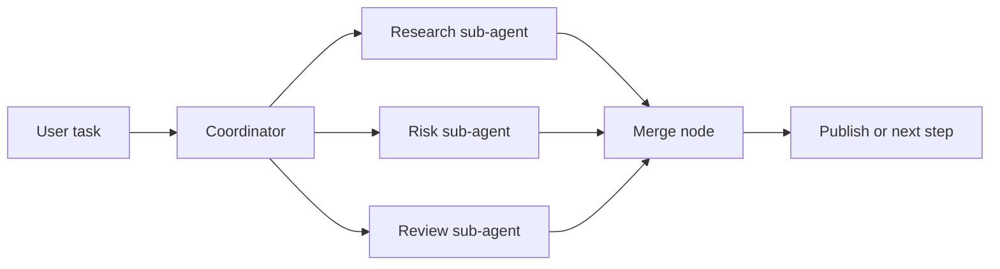

# Recipe: Parallel Sub-Agents And Workflow Fan-Out

Use this when one coordinator should split work immediately, but you still want a deterministic workflow stage after the fan-out.

## Good Fit

Choose this recipe when:

- one prompt naturally decomposes into independent specialist tasks
- you want fast fan-out first, then a stable graph-based merge step
- review and synthesis should be explicit rather than improvised in one big prompt

## Architecture



## Step 1: Enable The Runtime

```csharp
services.AddNexus(nexus =>
{
    nexus.UseChatClient(_ => chatClient);
    nexus.AddOrchestration(o => o.UseDefaults());
    nexus.AddWorkflowDsl();
    nexus.AddStandardTools(tools => tools.Agents());
});
```

## Step 2: Fan Out Inside The Coordinator

Use the `agent` tool for immediate delegation.

```json
{
  "maxConcurrency": 3,
  "tasks": [
    { "agent": "Researcher", "task": "Find the strongest supporting evidence" },
    { "agent": "RiskAnalyst", "task": "List failure modes and missing controls" },
    { "agent": "Reviewer", "task": "Look for weak assumptions and unclear claims" }
  ]
}
```

## Step 3: Formalize The Merge In The Workflow DSL

```json
{
  "id": "fanout-merge",
  "name": "Fan-Out Merge",
  "nodes": [
    {
      "id": "merge",
      "name": "Merge",
      "description": "Merge the sub-agent findings into one final brief"
    },
    {
      "id": "publish",
      "name": "Publish",
      "description": "Publish if the merged brief is approved"
    }
  ],
  "edges": [
    {
      "from": "merge",
      "to": "publish",
      "condition": "result.text.contains('approved')"
    }
  ],
  "options": {
    "maxConcurrentNodes": 4,
    "globalTimeoutSeconds": 300
  }
}
```

## Step 4: Execute The Workflow

```csharp
var executor = sp.GetRequiredService<IWorkflowExecutor>();
var workflow = sp.GetRequiredService<IWorkflowLoader>().LoadFromFileAsync("fanout-merge.json");

var result = await executor.ExecuteAsync(await workflow);
```

## Why This Split Works

- The sub-agent tool is ideal for quick local delegation.
- The workflow DSL is ideal for explicit merge, branch, and publish logic.
- `maxConcurrency` on the tool and `maxConcurrentNodes` on the workflow let you bound both levels independently.

## Operating Notes

- Keep sub-agent tasks independent to avoid hidden coupling.
- Use the workflow stage for approvals, publish gates, or retries.
- If all incoming conditional edges to a workflow node fail, Nexus now skips that node explicitly instead of running unreachable work.

## Related Guides

- [Sub-Agents](../guides/sub-agents.md)
- [Workflows DSL](../guides/workflows-dsl.md)
- [Human-Approved Workflow](human-approved-workflow.md)